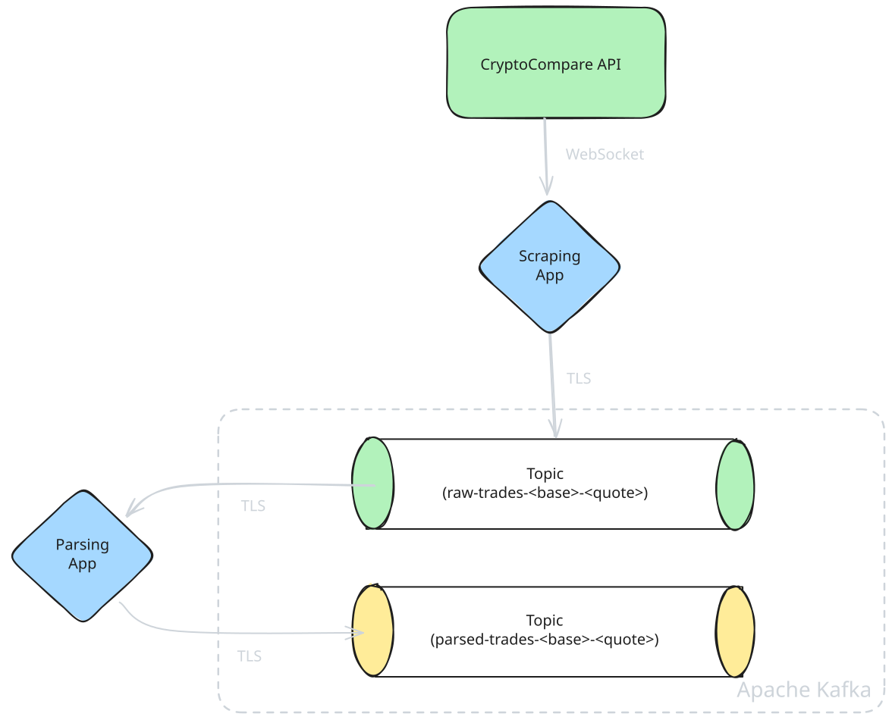

# Detailed Component Architecture

## Data Ingestion Subsystem

The data ingestion subsystem is responsible for continuously collecting real-time trade data from cryptocurrency exchanges and normalizing it for downstream processing.

> Data Ingestion subsystem showing scraper-to-parser pipeline
with Kafka as message broker

### Key Design Decisions:
- WebSocket Persistence: Maintains long-lived connections to minimize latency and connection overhead
- Topic Segregation: Separate topics per trading pair (e.g., raw-trades-btc-usdt) enable parallel processing and independent scaling
- Two-Stage Processing: Raw scraping separated from parsing allows independent failure handling and flexible schema evolution
- Singleton Producers: Each component maintains exactly one Kafka producer connection for efficiency
- Pattern Subscription: Parser uses regex to pic subscription (raw-trades-.*) to automatically consume from all trading pairs

