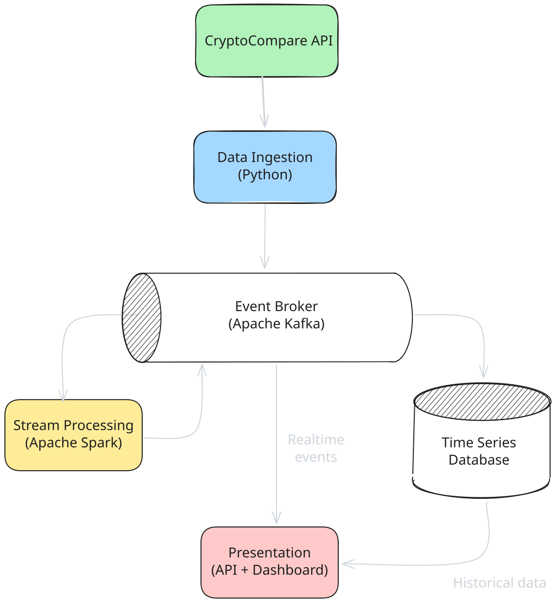

# Architectural Overview

The CryptoViz platform follows a **distributed**, **event-driven** architecture based on the
**microservices** pattern. 

The system consists of loosely coupled components that communicate asynchronously through **Apache Kafka** (the event broker), ensuring scalability, fault tolerance, and independent deployability. 

The architecture is organized into three major subsystems: **Data Ingestion**, **Stream Processing**, and **Presentation**.

 
 
