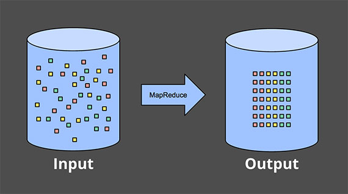
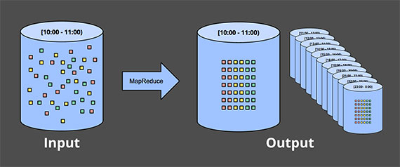
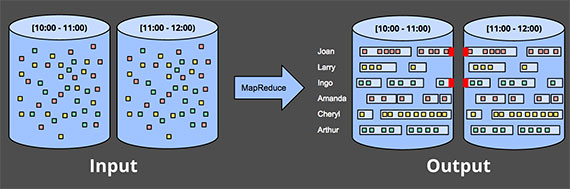
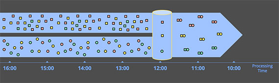
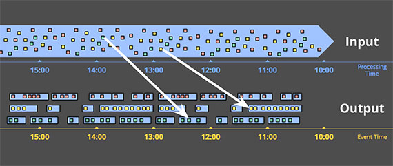

# Streaming 101 : Le monde au-delà du batch

> This article is a translation of the one from [*Tyler Akidau*](https://www.oreilly.com/people/tyler-akidau/) on the [Oreilly's website](https://www.oreilly.com/radar/the-world-beyond-batch-streaming-101/)

Le traitement de données en *streaming* est un sujet majeur dans le *big data* actuellement, et pour de bonnes raisons. Parmi elles :
- Les entreprises ont soif de données toujours plus actuelles, et passer au *streaming* est un bon moyen d'obtenir une latence plus faible.
- Les ensembles de données massifs et non bornés qui sont de plus en plus courants dans les entreprises modernes sont plus facilement maîtrisés avec un système conçu pour de tels volumes de données sans fin.
- Traiter les données au fur et à mesure qu'elles arrivent répartit les charges de travail de manière plus uniforme dans le temps, ce qui permet une consommation plus cohérente et prévisible des ressources.

Malgré ce regain d'intérêt commercial pour le *streaming*, la majorité des systèmes de *streaming* existants restent relativement immatures par rapport à leurs homologues *batch*, ce qui a entraîné beaucoup de développements actifs et passionnants dans ce domaine récemment.

En tant que personne ayant travaillé sur des systèmes de *streaming* à grande échelle chez Google pendant plus de cinq ans ([MillWheel](http://research.google.com/pubs/archive/41378.pdf), [Cloud Dataflow](http://cloud.google.com/dataflow/)), je suis ravi par cet engouement pour le *streaming*, c'est le moins qu'on puisse dire. Je souhaite également m'assurer que les gens comprennent tout ce dont les systèmes de *streaming* sont capables et comment ils peuvent être utilisés au mieux, en particulier compte tenu du fossé sémantique qui subsiste entre la plupart des systèmes *batch* et *streaming* existants. À cette fin, les excellentes personnes d'O'Reilly m'ont invité à contribuer une version écrite de ma présentation [Say Goodbye to Batch](http://strataconf.com/big-data-conference-uk-2015/public/schedule/detail/39966) donnée à [Strata + Hadoop World London 2015](http://strataconf.com/big-data-conference-uk-2015). Comme j'ai beaucoup de choses à couvrir, je vais diviser cela en deux articles distincts :

- **Streaming 101** : Ce premier article couvrira quelques informations contextuelles de base et clarifiera certains termes avant de plonger dans les détails sur les domaines temporels et un aperçu de haut niveau des approches courantes du traitement de données, à la fois *batch* et *streaming*.
- **The Dataflow Model** : Le second article consistera principalement en un tour d'horizon du modèle unifié *batch* + *streaming* utilisé par Cloud Dataflow, facilité par un exemple concret appliqué à un ensemble diversifié de cas d'usage. Après cela, je conclurai avec une brève comparaison sémantique des systèmes *batch* et *streaming* existants.

Donc, les longues introductions terminées, passons aux choses sérieuses.

## Contexte

Pour commencer, je vais couvrir quelques informations contextuelles importantes qui aideront à cadrer le reste des sujets que je souhaite aborder. Nous le ferons en trois sections spécifiques :

- **Terminologie** : Pour parler précisément de sujets complexes, il faut des définitions précises des termes. Pour certains termes qui ont des interprétations surchargées dans l'usage actuel, j'essaierai de préciser exactement ce que je veux dire quand je les utilise.
- **Capacités** : Je remarquerai les lacunes souvent perçues des systèmes de *streaming*. Je proposerai également l'état d'esprit que je crois que les créateurs de systèmes de traitement de données doivent adopter pour répondre aux besoins des consommateurs de données modernes à l'avenir.
- **Domaines temporels** : Je présenterai les deux principaux domaines temporels pertinents dans le traitement de données, montrerai comment ils sont liés et soulignerai certaines des difficultés que ces deux domaines imposent.

### Terminologie : Qu'est-ce que le streaming ?

Avant d'aller plus loin, j'aimerais clarifier une chose : qu'est-ce que le *streaming* ? Le terme "*streaming*" est utilisé aujourd'hui pour désigner diverses choses différentes (et par simplicité, je l'ai utilisé de manière quelque peu lâche jusqu'à présent), ce qui peut conduire à des malentendus sur ce qu'est réellement le *streaming*, ou sur ce dont les systèmes de *streaming* sont réellement capables. En tant que tel, je préférerais définir le terme de manière assez précise.

Le cœur du problème est que beaucoup de choses qui devraient être décrites par ce qu'elles sont (par exemple, le traitement de données non bornées, les résultats approximatifs, etc.) ont fini par être décrites de manière familière par la façon dont elles ont historiquement été accomplies (c'est-à-dire via des moteurs d'exécution de *streaming*). Ce manque de précision dans la terminologie obscurcit ce que le *streaming* signifie vraiment, et dans certains cas, charge les systèmes de *streaming* eux-mêmes de l'implication que leurs capacités sont limitées aux caractéristiques fréquemment décrites comme "*streaming*", telles que les résultats approximatifs ou spéculatifs. Étant donné que les systèmes de *streaming* bien conçus sont tout aussi capables (techniquement plus encore) de produire des résultats corrects, cohérents et reproductibles que n'importe quel moteur *batch* existant, je préfère isoler le terme *streaming* à une signification très spécifique : **un type de moteur de traitement de données conçu avec des ensembles de données infinis à l'esprit. Rien de plus.** (Par souci d'exhaustivité, il vaut peut-être la peine de souligner que cette définition inclut les implémentations de vrai *streaming* et de *micro-batch*.)

Quant aux autres utilisations courantes de "*streaming*", en voici quelques-unes que j'entends régulièrement, chacune présentée avec les termes plus précis et descriptifs que je suggère que nous, en tant que communauté, devrions essayer d'adopter :

- **Données non bornées** (*Unbounded data*) : Un type d'ensemble de données en constante croissance, essentiellement infini. On les appelle souvent "données de *streaming*". Cependant, les termes *streaming* ou *batch* sont problématiques lorsqu'ils sont appliqués aux ensembles de données, car comme noté ci-dessus, ils impliquent l'utilisation d'un certain type de moteur d'exécution pour traiter ces ensembles de données. La distinction clé entre les deux types d'ensembles de données en question est, en réalité, leur finitude, et il est donc préférable de les caractériser par des termes qui capturent cette distinction. En tant que tel, je ferai référence aux ensembles de données "*streaming*" infinis comme **données non bornées** (*unbounded data*), et aux ensembles de données "*batch*" finis comme **données bornées** (*bounded data*).

- **Traitement de données non bornées** (*Unbounded data processing*) : Un mode de traitement de données continu, appliqué au type de données non bornées mentionné ci-dessus. Bien que j'aime personnellement l'utilisation du terme *streaming* pour décrire ce type de traitement de données, son utilisation dans ce contexte implique à nouveau l'emploi d'un moteur d'exécution de *streaming*, ce qui est au mieux trompeur ; les exécutions répétées de moteurs *batch* ont été utilisées pour traiter des données non bornées depuis que les systèmes *batch* ont été conçus pour la première fois (et inversement, les systèmes de *streaming* bien conçus sont plus que capables de gérer des charges de travail "*batch*" sur des données bornées). En tant que tel, par souci de clarté, je ferai simplement référence à cela comme **traitement de données non bornées**.

- **Résultats à faible latence, approximatifs et/ou spéculatifs** : Ces types de résultats sont le plus souvent associés aux moteurs de *streaming*. Le fait que les systèmes *batch* n'aient traditionnellement pas été conçus avec des résultats à faible latence ou spéculatifs à l'esprit est un artefact historique, et rien de plus. Et bien sûr, les moteurs *batch* sont parfaitement capables de produire des résultats approximatifs s'ils en reçoivent l'instruction. Ainsi, comme pour les termes ci-dessus, il est bien préférable de décrire ces résultats par ce qu'ils sont (à faible latence, approximatifs et/ou spéculatifs) plutôt que par la façon dont ils se sont historiquement manifestés (via des moteurs de *streaming*).

À partir de maintenant, chaque fois que j'utilise le terme "*streaming*", vous pouvez en toute sécurité supposer que je veux dire un moteur d'exécution conçu pour des ensembles de données non bornés, et rien de plus. Lorsque je veux dire l'un des autres termes ci-dessus, je dirai explicitement données non bornées, traitement de données non bornées ou résultats à faible latence / approximatifs / spéculatifs. Ce sont les termes que nous avons adoptés au sein de Cloud Dataflow, et j'encourage les autres à prendre une position similaire.

### Sur les limitations grandement exagérées du streaming

Ensuite, parlons un peu de ce que les systèmes de *streaming* peuvent et ne peuvent pas faire, avec un accent sur "peuvent" ; l'une des plus grandes choses que je veux faire passer dans ces articles est à quel point un système de *streaming* bien conçu peut être capable. Les systèmes de *streaming* ont longtemps été relégués à un marché quelque peu de niche consistant à fournir des résultats à faible latence, inexacts/spéculatifs, souvent en conjonction avec un système *batch* plus capable pour fournir des résultats finalement corrects, c'est-à-dire la [Lambda Architecture](http://nathanmarz.com/blog/how-to-beat-the-cap-theorem.html).

Pour ceux d'entre vous qui ne sont pas déjà familiers avec la *Lambda Architecture*, l'idée de base est que vous exécutez un système de *streaming* à côté d'un système *batch*, les deux effectuant essentiellement le même calcul. Le système de *streaming* vous donne des résultats à faible latence et inexacts (soit en raison de l'utilisation d'un algorithme d'approximation, soit parce que le système de *streaming* lui-même ne fournit pas la justesse), et quelque temps plus tard, un système *batch* arrive et vous fournit une sortie correcte. Proposée à l'origine par [Nathan Marz](https://twitter.com/nathanmarz) de Twitter (créateur de [Storm](http://storm.apache.org)), elle a fini par avoir beaucoup de succès car c'était, en fait, une idée fantastique pour l'époque ; les moteurs de *streaming* étaient un peu décevants dans le département de la justesse, et les moteurs *batch* étaient aussi intrinsèquement lourds qu'on pourrait s'y attendre, donc Lambda vous donnait un moyen d'avoir votre gâteau proverbial et de le manger aussi. Malheureusement, maintenir un système Lambda est une corvée : vous devez construire, provisionner et maintenir deux versions indépendantes de votre *pipeline*, puis aussi fusionner les résultats des deux *pipelines* à la fin.

En tant que personne qui a passé des années à travailler sur un moteur de *streaming* fortement cohérent, j'ai également trouvé le principe entier de la *Lambda Architecture* un peu désagréable. Sans surprise, j'étais un grand fan de l'article de [Jay Kreps](https://twitter.com/jaykreps?lang=en) [Questioning the Lambda Architecture](https://www.oreilly.com/radar/questioning-the-lambda-architecture/) quand il est sorti. C'était l'une des premières déclarations très visibles contre la nécessité d'une exécution bi-mode ; délicieux. Kreps a abordé la question de la répétabilité dans le contexte de l'utilisation d'un système rejouable comme Kafka comme interconnexion de *streaming*, et est allé jusqu'à proposer la *Kappa Architecture*, qui signifie essentiellement exécuter un seul *pipeline* en utilisant un système bien conçu qui est approprié pour le travail à accomplir. Je ne suis pas convaincu que cette notion elle-même nécessite un nom, mais je soutiens pleinement l'idée en principe.

Très honnêtement, j'irais encore plus loin. Je dirais que les systèmes de *streaming* bien conçus fournissent en fait un sur-ensemble strict de la fonctionnalité *batch*. Modulo peut-être un delta d'efficacité[1](#note1), il ne devrait pas y avoir besoin de systèmes *batch* tels qu'ils existent aujourd'hui. Et bravo aux gens de [Flink](http://flink.apache.org) pour avoir pris cette idée à cœur et construit un système qui est tout-*streaming*-tout-le-temps sous le capot, même en mode "*batch*" ; j'adore ça.

Le corollaire de tout cela est que la maturation généralisée des systèmes de *streaming* combinée à des *frameworks* robustes pour le traitement de données non bornées permettra, avec le temps, de reléguer la *Lambda Architecture* à l'antiquité de l'histoire du *big data* où elle appartient. Je crois que le moment est venu de faire de cela une réalité. Parce que pour le faire, c'est-à-dire pour battre le *batch* à son propre jeu, vous n'avez vraiment besoin que de deux choses :

- **Justesse** (*Correctness*) — Cela vous donne la parité avec le *batch*.
  Au cœur, la justesse se résume au stockage cohérent. Les systèmes de *streaming* ont besoin d'une méthode pour créer des *checkpoints* d'état persistant au fil du temps (quelque chose dont Kreps a parlé dans son article [Why local state is a fundamental primitive in stream processing](https://www.oreilly.com/content/why-local-state-is-a-fundamental-primitive-in-stream-processing/)), et elle doit être suffisamment bien conçue pour rester cohérente face aux défaillances de machines. Lorsque *Spark Streaming* est apparu pour la première fois sur la scène publique du *big data* il y a quelques années, c'était un phare de cohérence dans un monde de *streaming* autrement sombre. Heureusement, les choses se sont quelque peu améliorées depuis, mais il est remarquable de voir combien de systèmes de *streaming* tentent encore de s'en sortir sans cohérence forte ; je ne peux vraiment pas croire que le traitement *at-most-once* soit encore une chose, mais c'est le cas. Pour réitérer, parce que ce point est important : **la cohérence forte est requise pour le traitement *exactly-once*, qui est requis pour la justesse, qui est une exigence pour tout système qui veut avoir une chance de répondre ou de dépasser les capacités des systèmes *batch***. À moins que vous ne vous souciez vraiment pas de vos résultats, je vous implore de fuir tout système de *streaming* qui ne fournit pas d'état fortement cohérent. Les systèmes *batch* n'exigent pas que vous vérifiiez à l'avance s'ils sont capables de produire des réponses correctes ; ne perdez pas votre temps avec des systèmes de *streaming* qui ne peuvent pas atteindre cette même barre. Si vous êtes curieux d'en savoir plus sur ce qu'il faut pour obtenir une cohérence forte dans un système de *streaming*, je vous recommande de consulter les articles [MillWheel](http://static.googleusercontent.com/media/research.google.com/en//pubs/archive/41378.pdf) et [Spark Streaming](https://www.cs.berkeley.edu/~matei/papers/2012/hotcloud_spark_streaming.pdf). Les deux articles consacrent beaucoup de temps à discuter de la cohérence. Étant donné la quantité d'informations de qualité sur ce sujet dans la littérature et ailleurs, je ne le couvrirai pas davantage dans ces articles.

- **Outils pour raisonner sur le temps** — Cela vous fait aller au-delà du *batch*.
  De bons outils pour raisonner sur le temps sont essentiels pour traiter des données non bornées, non ordonnées avec un *skew* d'*event time* variable. Un nombre croissant d'ensembles de données modernes présentent ces caractéristiques, et les systèmes *batch* existants (ainsi que la plupart des systèmes de *streaming*) manquent des outils nécessaires pour faire face aux difficultés qu'ils imposent. Je passerai le reste de cet article, et la majeure partie du prochain article, à expliquer et à me concentrer sur ce point. Pour commencer, nous obtiendrons une compréhension de base du concept important des domaines temporels, après quoi nous examinerons plus en profondeur ce que je veux dire par données non bornées, non ordonnées avec un *skew* d'*event time* variable. Nous passerons ensuite le reste de cet article à examiner les approches courantes du traitement de données bornées et non bornées, en utilisant à la fois des systèmes *batch* et *streaming*.

## Event time vs. processing time

Pour parler de manière cohérente du traitement de données non bornées, il faut une compréhension claire des domaines temporels impliqués. Au sein de tout système de traitement de données, il y a généralement deux domaines temporels qui nous intéressent :

- **Event time** (*temps d'événement*), qui est le moment où les événements se sont réellement produits.
- **Processing time** (*temps de traitement*), qui est le moment où les événements sont observés dans le système.

Tous les cas d'usage ne se soucient pas des *event times* (et si le vôtre ne le fait pas, hourra ! — votre vie est plus facile), mais beaucoup le font. Les exemples incluent la caractérisation du comportement des utilisateurs au fil du temps, la plupart des applications de facturation et de nombreux types de détection d'anomalies, pour n'en nommer que quelques-uns.

Dans un monde idéal, l'*event time* et le *processing time* seraient toujours égaux, les événements étant traités immédiatement au moment où ils se produisent. La réalité n'est pas si gentille, cependant, et le *skew* entre l'*event time* et le *processing time* est non seulement non nul, mais souvent une fonction très variable des caractéristiques des sources d'entrée sous-jacentes, du moteur d'exécution et du matériel. Les choses qui peuvent affecter le niveau de *skew* incluent :

- Les limitations des ressources partagées, telles que la congestion du réseau, les partitions du réseau ou le CPU partagé dans un environnement non dédié.
- Les causes logicielles, telles que la logique du système distribué, la contention, etc.
- Les caractéristiques des données elles-mêmes, y compris la distribution des clés, la variance du débit ou la variance dans le désordre (par exemple, un avion plein de personnes sortant leurs téléphones du mode avion après les avoir utilisés hors ligne pendant tout le vol).

En conséquence, si vous tracez la progression de l'*event time* et du *processing time* dans n'importe quel système du monde réel, vous vous retrouvez généralement avec quelque chose qui ressemble un peu à la ligne rouge dans la Figure 1.

> **Figure 1 : Exemple de correspondance des domaines temporels.** 
>
> L'axe des X représente la complétude du temps d'événement dans le système, c'est-à-dire le temps X dans le temps d'événement jusqu'auquel toutes les données avec des temps d'événement inférieurs à X ont été observées. L'axe des Y représente la progression du temps de traitement, c'est-à-dire le temps d'horloge normal tel qu'observé par le système de traitement de données lors de son exécution. 
>
> Image : *Tyler Akidau.*

La ligne noire en pointillés avec une pente de un représente l'idéal, où le *processing time* et l'*event time* sont exactement égaux ; la ligne rouge représente la réalité. Dans cet exemple, le système prend un peu de retard au début du *processing time*, se rapproche de l'idéal au milieu, puis prend à nouveau du retard un peu vers la fin. La distance horizontale entre l'idéal et la ligne rouge est le *skew* entre le *processing time* et l'*event time*. Ce *skew* est essentiellement la latence introduite par le *pipeline* de traitement.

Puisque la correspondance entre l'*event time* et le *processing time* n'est pas statique, cela signifie que vous ne pouvez pas analyser vos données uniquement dans le contexte de quand elles sont observées dans votre *pipeline* si vous vous souciez de leurs *event times* (c'est-à-dire quand les événements se sont réellement produits). Malheureusement, c'est la façon dont la plupart des systèmes existants conçus pour les données non bornées fonctionnent. Pour faire face à la nature infinie des ensembles de données non bornés, ces systèmes fournissent généralement une notion de *windowing* (fenêtrage) des données entrantes. Nous discuterons du *windowing* en profondeur ci-dessous, mais cela signifie essentiellement découper un ensemble de données en morceaux finis le long de limites temporelles.

Si vous vous souciez de la justesse et que vous êtes intéressé par l'analyse de vos données dans le contexte de leurs *event times*, vous ne pouvez pas définir ces limites temporelles en utilisant le *processing time* (c'est-à-dire le *windowing* par *processing time*), comme le font la plupart des systèmes existants ; sans corrélation cohérente entre le *processing time* et l'*event time*, certaines de vos données d'*event time* vont se retrouver dans les mauvaises fenêtres de *processing time* (en raison du retard inhérent aux systèmes distribués, de la nature en ligne/hors ligne de nombreux types de sources d'entrée, etc.), jetant la justesse par la fenêtre, pour ainsi dire. Nous examinerons ce problème plus en détail dans un certain nombre d'exemples ci-dessous ainsi que dans le prochain article.

Malheureusement, le tableau n'est pas exactement rose non plus lors du *windowing* par *event time*. Dans le contexte des données non bornées, le désordre et le *skew* variable induisent un problème de complétude pour les fenêtres d'*event time* : en l'absence d'une correspondance prévisible entre le *processing time* et l'*event time*, comment pouvez-vous déterminer quand vous avez observé toutes les données pour un *event time* X donné ? Pour de nombreuses sources de données du monde réel, vous ne pouvez tout simplement pas. La grande majorité des systèmes de traitement de données utilisés aujourd'hui s'appuient sur une notion de complétude, ce qui les met dans une position très désavantageuse lorsqu'ils sont appliqués à des ensembles de données non bornés.

Je propose qu'au lieu d'essayer de transformer des données non bornées en lots finis d'informations qui finissent par devenir complets, nous devrions concevoir des outils qui nous permettent de vivre dans le monde de l'incertitude imposé par ces ensembles de données complexes. De nouvelles données arriveront, d'anciennes données peuvent être rétractées ou mises à jour, et tout système que nous construisons devrait être capable de faire face à ces faits par lui-même, les notions de complétude étant une optimisation pratique plutôt qu'une nécessité sémantique.

Avant de plonger dans la façon dont nous avons essayé de construire un tel système avec le *Dataflow Model* utilisé dans Cloud Dataflow, terminons un autre élément utile du contexte : les modèles courants de traitement de données.

## Modèles de traitement de données

À ce stade, nous avons suffisamment de contexte établi pour que nous puissions commencer à examiner les principaux types de modèles d'utilisation courants dans le traitement de données bornées et non bornées aujourd'hui. Nous examinerons les deux types de traitement, et le cas échéant, dans le contexte des deux principaux types de moteurs qui nous intéressent (*batch* et *streaming*, où dans ce contexte, je regroupe essentiellement le *micro-batch* avec le *streaming* car les différences entre les deux ne sont pas terriblement importantes à ce niveau).

### Données bornées

Le traitement de données bornées est assez simple et probablement familier à tout le monde. Dans le diagramme ci-dessous, nous commençons à gauche avec un ensemble de données plein d'entropie. Nous le faisons passer à travers un moteur de traitement de données (généralement *batch*, bien qu'un moteur de *streaming* bien conçu fonctionnerait tout aussi bien), tel que [MapReduce](http://research.google.com/archive/mapreduce-osdi04.pdf), et à droite nous nous retrouvons avec un nouvel ensemble de données structuré avec une valeur inhérente plus grande :

>**Figure 2 : Traitement de données bornées avec un moteur batch classique.**
>
>Un ensemble fini de données non structurées à gauche est traité par un moteur de traitement de données, produisant des données structurées correspondantes à droite.
>
>Image : *Tyler Akidau.*

Bien qu'il y ait, bien sûr, des variations infinies sur ce que vous pouvez réellement calculer dans le cadre de ce schéma, le modèle global est assez simple. Beaucoup plus intéressante est la tâche de traiter un ensemble de données non borné. Examinons maintenant les différentes façons dont les données non bornées sont généralement traitées, en commençant par les approches utilisées avec les moteurs *batch* traditionnels, puis en terminant par les approches que l'on peut adopter avec un système conçu pour les données non bornées, comme la plupart des moteurs de *streaming* ou de *micro-batch*.

### Données non bornées — batch

Les moteurs *batch*, bien qu'ils ne soient pas explicitement conçus pour les données non bornées, ont été utilisés pour traiter des ensembles de données non bornés depuis que les systèmes *batch* ont été conçus pour la première fois. Comme on pourrait s'y attendre, de telles approches tournent autour du découpage des données non bornées en une collection d'ensembles de données bornés appropriés pour le traitement *batch*.

#### Fixed windows

La façon la plus courante de traiter un ensemble de données non borné en utilisant des exécutions répétées d'un moteur *batch* est de fenêtrer les données d'entrée dans des *fixed windows* (fenêtres fixes), puis de traiter chacune de ces fenêtres comme une source de données bornée distincte. En particulier pour les sources d'entrée comme les *logs*, où les événements peuvent être écrits dans des hiérarchies de répertoires et de fichiers dont les noms encodent la fenêtre à laquelle ils correspondent, ce genre de chose semble assez simple à première vue puisque vous avez essentiellement effectué le *shuffle* temporel pour mettre les données dans les fenêtres d'*event time* appropriées à l'avance.

En réalité, cependant, la plupart des systèmes ont encore un problème de complétude à gérer : que se passe-t-il si certains de vos événements sont retardés en route vers les *logs* en raison d'une partition réseau ? Que se passe-t-il si vos événements sont collectés globalement et doivent être transférés vers un emplacement commun avant le traitement ? Que se passe-t-il si vos événements proviennent d'appareils mobiles ? Cela signifie qu'une sorte d'atténuation peut être nécessaire (par exemple, retarder le traitement jusqu'à ce que vous soyez sûr que tous les événements ont été collectés, ou retraiter l'ensemble du *batch* pour une fenêtre donnée chaque fois que des données arrivent en retard).

>**Figure 3 : Traitement de données illimitées via des fenêtres fixes ad hoc avec un moteur de traitement par lots classique.**
>
>Un ensemble de données illimitées est collecté en amont dans des fenêtres fixes de taille finie contenant des données délimitées, qui sont ensuite traitées par des exécutions successives d'un moteur de traitement par lots classique.
>
>Image : *Tyler Akidau.*

#### Sessions

Cette approche s'effondre encore plus lorsque vous essayez d'utiliser un moteur *batch* pour traiter des données non bornées dans des stratégies de *windowing* plus sophistiquées, comme les *sessions*. Les *sessions* sont généralement définies comme des périodes d'activité (par exemple, pour un utilisateur spécifique) terminées par un écart d'inactivité. Lors du calcul de *sessions* à l'aide d'un moteur *batch* typique, vous vous retrouvez souvent avec des *sessions* divisées entre les *batches*, comme indiqué par les marques rouges dans le diagramme ci-dessous. Le nombre de divisions peut être réduit en augmentant la taille des *batches*, mais au prix d'une latence accrue. Une autre option consiste à ajouter une logique supplémentaire pour reconstituer les *sessions* des exécutions précédentes, mais au prix d'une complexité supplémentaire.

> **Figure 4 : Traitement de données non bornées en sessions via des fenêtres fixes ad hoc avec un moteur de traitement par lots classique.**
>
> Un ensemble de données non bornées est collecté au préalable dans des fenêtres fixes de taille finie contenant des données bornées, qui sont ensuite subdivisées en fenêtres de session dynamiques via des exécutions successives d'un moteur de traitement par lots classique.
>
> Image : *Tyler Akidau.*

De toute façon, utiliser un moteur *batch* classique pour calculer des *sessions* est loin d'être idéal. Une meilleure façon serait de construire des *sessions* de manière *streaming*, ce que nous examinerons plus tard.

### Données non bornées — streaming

Contrairement à la nature ad hoc de la plupart des approches de traitement de données non bornées basées sur le *batch*, les systèmes de *streaming* sont construits pour les données non bornées. Comme je l'ai noté plus tôt, pour de nombreuses sources d'entrée distribuées du monde réel, vous ne vous retrouvez pas seulement à traiter des données non bornées, mais aussi des données qui sont :

- Fortement désordonnées par rapport aux *event times*, ce qui signifie que vous avez besoin d'une sorte de *shuffle* temporel dans votre *pipeline* si vous voulez analyser les données dans le contexte dans lequel elles se sont produites.
- Avec un *skew* d'*event time* variable, ce qui signifie que vous ne pouvez pas simplement supposer que vous verrez toujours la plupart des données pour un *event time* X donné dans un epsilon constant de temps Y.

Il existe une poignée d'approches que l'on peut adopter lorsqu'on traite des données qui ont ces caractéristiques. Je catégorise généralement ces approches en quatre groupes :

- Temps-agnostique (*Time-agnostic*)
- Approximation
- *Windowing* par *processing time*
- *Windowing* par *event time*

Nous allons maintenant passer un peu de temps à examiner chacune de ces approches.

#### Time-agnostic

Le traitement temps-agnostique est utilisé dans les cas où le temps est essentiellement sans importance — c'est-à-dire que toute logique pertinente est pilotée par les données. Puisque tout dans de tels cas d'usage est dicté par l'arrivée de plus de données, il n'y a vraiment rien de spécial qu'un moteur de *streaming* doit supporter autre que la livraison de données de base. En conséquence, essentiellement tous les systèmes de *streaming* existants supportent les cas d'usage temps-agnostiques dès le départ (modulo les variances système-à-système dans les garanties de cohérence, bien sûr, pour ceux d'entre vous qui se soucient de la justesse). Les systèmes *batch* sont également bien adaptés au traitement temps-agnostique de sources de données non bornées, en découpant simplement la source non bornée en une séquence arbitraire d'ensembles de données bornés et en traitant ces ensembles de données indépendamment. Nous examinerons quelques exemples concrets dans cette section, mais étant donné la simplicité de la gestion du traitement temps-agnostique, nous ne passerons pas beaucoup plus de temps là-dessus au-delà de cela.

##### Filtering

Une forme très basique de traitement temps-agnostique est le filtrage. Imaginez que vous traitez des *logs* de trafic Web, et que vous voulez filtrer tout le trafic qui ne provient pas d'un domaine spécifique. Vous regarderiez chaque enregistrement à son arrivée, verriez s'il appartient au domaine d'intérêt, et le supprimeriez sinon. Puisque ce genre de chose ne dépend que d'un seul élément à tout moment, le fait que la source de données soit non bornée, non ordonnée et avec un *skew* d'*event time* variable est sans importance.

> **Figure 5 : Filtrage de données non bornées.**
>
> Une collection de données (s'écoulant de gauche à droite) de types variés est filtrée en une collection homogène contenant un seul type.
>
> Image : *Tyler Akidau.*

##### Inner-joins

Un autre exemple temps-agnostique est une *inner-join* (ou *hash-join*). Lors de la jointure de deux sources de données non bornées, si vous ne vous souciez des résultats d'une jointure que lorsqu'un élément des deux sources arrive, il n'y a pas d'élément temporel à la logique. En voyant une valeur d'une source, vous pouvez simplement la mettre en *buffer* dans un état persistant ; vous n'avez besoin d'émettre l'enregistrement joint qu'une fois que la deuxième valeur de l'autre source arrive. (En vérité, vous voudriez probablement une sorte de politique de collecte des ordures pour les jointures partielles non émises, qui serait probablement basée sur le temps. Mais pour un cas d'usage avec peu ou pas de jointures incomplètes, une telle chose pourrait ne pas être un problème.)

> **Figure 6 : Réalisation d'une jointure interne sur des données non bornées.**
>
> Les jointures sont produites lorsque des éléments correspondants des deux sources sont observés.
>
> Image : *Tyler Akidau.*

Changer la sémantique en une sorte d'*outer join* introduit le problème de complétude des données dont nous avons parlé : une fois que vous avez vu un côté de la jointure, comment savez-vous si l'autre côté va jamais arriver ou non ? En vérité, vous ne le savez pas, donc vous devez introduire une notion de *timeout*, qui introduit un élément de temps. Cet élément de temps est essentiellement une forme de *windowing*, que nous examinerons de plus près dans un moment.

#### Algorithmes d'approximation

> Figure 7 : Calcul d'approximations sur des données non bornées.
> Les données sont traitées par un algorithme complexe, produisant des données de sortie qui ressemblent plus ou moins au résultat souhaité de l'autre côté. 
>
> Image : *Tyler Akidau.*

La deuxième catégorie majeure d'approches est les algorithmes d'approximation, tels que [approximate Top-N](https://pkghosh.wordpress.com/2014/09/10/realtime-trending-analysis-with-approximate-algorithms/), [streaming K-means](https://databricks.com/blog/2015/01/28/introducing-streaming-k-means-in-spark-1-2.html), etc. Ils prennent une source non bornée d'entrée et fournissent des données de sortie qui, si vous les regardez de travers, ressemblent plus ou moins à ce que vous espériez obtenir. L'avantage des algorithmes d'approximation est que, par conception, ils sont peu coûteux et conçus pour les données non bornées. Les inconvénients sont qu'un ensemble limité d'entre eux existe, que les algorithmes eux-mêmes sont souvent compliqués (ce qui rend difficile d'en créer de nouveaux), et que leur nature approximative limite leur utilité.

Il convient de noter : ces algorithmes ont généralement un élément de temps dans leur conception (par exemple, une sorte de *decay* intégré). Et puisqu'ils traitent les éléments au fur et à mesure qu'ils arrivent, cet élément de temps est généralement basé sur le *processing time*. C'est particulièrement important pour les algorithmes qui fournissent une sorte de limites d'erreur prouvables sur leurs approximations. Si ces limites d'erreur sont basées sur l'arrivée des données dans l'ordre, elles ne signifient essentiellement rien lorsque vous alimentez l'algorithme avec des données non ordonnées avec un *skew* d'*event time* variable. Quelque chose à garder à l'esprit.

Les algorithmes d'approximation eux-mêmes sont un sujet fascinant, mais comme ils sont essentiellement un autre exemple de traitement temps-agnostique (modulo les caractéristiques temporelles des algorithmes eux-mêmes), ils sont assez simples à utiliser, et donc ne méritent pas plus d'attention étant donné notre focus actuel.

#### Windowing

Les deux approches restantes pour le traitement de données non bornées sont toutes deux des variations du *windowing*. Avant de plonger dans les différences entre elles, je devrais clarifier exactement ce que je veux dire par *windowing* puisque je ne l'ai abordé que brièvement. Le *windowing* est simplement la notion de prendre une source de données (soit non bornée soit bornée), et de la découper le long de limites temporelles en morceaux finis pour le traitement. Le diagramme suivant montre trois modèles de *windowing* différents :

> **Figure 8 : Exemples de stratégies de fenêtrage.**
>
> Chaque exemple est présenté pour trois clés différentes, mettant en évidence la différence entre les fenêtres alignées (qui s'appliquent à l'ensemble des données) et les fenêtres non alignées (qui s'appliquent à un sous-ensemble des données).
> 
> Image : *Tyler Akidau.*

- **Fixed windows** (Fenêtres fixes) : Les *fixed windows* découpent le temps en segments d'une longueur temporelle de taille fixe. Typiquement (comme dans la Figure 8), les segments pour les *fixed windows* sont appliqués uniformément sur l'ensemble de données entier, ce qui est un exemple de *aligned windows* (fenêtres alignées). Dans certains cas, il est souhaitable de décaler en phase les fenêtres pour différents sous-ensembles de données (par exemple, par clé) pour répartir la charge de complétion des fenêtres de manière plus uniforme dans le temps, ce qui est plutôt un exemple d'*unaligned windows* (fenêtres non alignées) puisqu'elles varient à travers les données.

- **Sliding windows** (Fenêtres glissantes) : Une généralisation des *fixed windows*, les *sliding windows* sont définies par une longueur fixe et une période fixe. Si la période est inférieure à la longueur, alors les fenêtres se chevauchent. Si la période est égale à la longueur, vous avez des *fixed windows*. Et si la période est supérieure à la longueur, vous avez une sorte étrange de fenêtre d'échantillonnage qui ne regarde que des sous-ensembles de données au fil du temps. Comme pour les *fixed windows*, les *sliding windows* sont généralement alignées, bien qu'elles puissent être non alignées comme optimisation de performance dans certains cas d'usage. Notez que les *sliding windows* dans la Figure 8 sont dessinées comme elles le sont pour donner un sens de mouvement glissant ; en réalité, les cinq fenêtres s'appliqueraient à l'ensemble de données entier.

- **Sessions** : Un exemple de *dynamic windows* (fenêtres dynamiques), les *sessions* sont composées de séquences d'événements terminées par un écart d'inactivité supérieur à un *timeout*. Les *sessions* sont couramment utilisées pour analyser le comportement des utilisateurs au fil du temps, en regroupant une série d'événements temporellement liés (par exemple, une séquence de vidéos visionnées en une séance). Les *sessions* sont intéressantes car leurs longueurs ne peuvent pas être définies a priori ; elles dépendent des données réelles impliquées. Ce sont aussi l'exemple canonique de *unaligned windows* puisque les *sessions* ne sont pratiquement jamais identiques à travers différents sous-ensembles de données (par exemple, différents utilisateurs).

Les deux domaines temporels discutés — *processing time* et *event time* — sont essentiellement les deux qui nous intéressent[2](#note2). Le *windowing* a du sens dans les deux domaines, donc nous examinerons chacun en détail et verrons comment ils diffèrent. Puisque le *windowing* par *processing time* est beaucoup plus courant dans les systèmes existants, je commencerai par là.

#### Windowing par processing time

> **Figure 9 : Fenêtrage en fenêtres fixes par temps de traitement.**
>
> Les données sont collectées dans des fenêtres en fonction de l'ordre dans lequel elles arrivent dans le pipeline.
> 
> Image : *Tyler Akidau.*

Lors du *windowing* par *processing time*, le système met essentiellement en *buffer* les données entrantes dans des fenêtres jusqu'à ce qu'un certain temps de traitement se soit écoulé. Par exemple, dans le cas de *fixed windows* de cinq minutes, le système mettrait en *buffer* les données pendant cinq minutes de *processing time*, après quoi il traiterait toutes les données qu'il a observées dans ces cinq minutes comme une fenêtre et les enverrait en aval pour traitement.

Il y a quelques belles propriétés du *windowing* par *processing time* :

- **C'est simple.** L'implémentation est extrêmement simple puisque vous ne vous inquiétez jamais de mélanger les données dans le temps. Vous mettez simplement les choses en *buffer* au fur et à mesure qu'elles arrivent et les envoyez en aval lorsque la fenêtre se ferme.
- **Juger la complétude de la fenêtre est simple.** Puisque le système a une connaissance parfaite de si toutes les entrées pour une fenêtre ont été vues ou non, il peut prendre des décisions parfaites sur si une fenêtre donnée est complète ou non. Cela signifie qu'il n'y a pas besoin d'être capable de gérer les données "tardives" de quelque manière que ce soit lors du *windowing* par *processing time*.
- **Si vous voulez déduire des informations sur la source telle qu'elle est observée, le windowing par processing time est exactement ce dont vous avez besoin.** De nombreux scénarios de surveillance entrent dans cette catégorie. Imaginez suivre le nombre de requêtes par seconde envoyées à un service Web à l'échelle mondiale. Calculer un taux de ces requêtes dans le but de détecter des pannes est une utilisation parfaite du *windowing* par *processing time*.

Bons points mis à part, il y a un très gros inconvénient au *windowing* par *processing time* : si les données en question ont des *event times* associés, ces données doivent arriver dans l'ordre des *event times* si les fenêtres de *processing time* doivent refléter la réalité de quand ces événements se sont réellement produits. Malheureusement, les données ordonnées par *event time* sont peu courantes dans de nombreuses sources d'entrée distribuées du monde réel.

Comme exemple simple, imaginez n'importe quelle application mobile qui collecte des statistiques d'utilisation pour un traitement ultérieur. Dans les cas où un appareil mobile donné est hors ligne pendant un certain temps (brève perte de connectivité, mode avion lors d'un vol à travers le pays, etc.), les données enregistrées pendant cette période ne seront téléchargées qu'une fois l'appareil en ligne à nouveau. Cela signifie que les données peuvent arriver avec un *skew* d'*event time* de minutes, heures, jours, semaines, ou plus. Il est essentiellement impossible de tirer des déductions utiles d'un tel ensemble de données lorsqu'il est fenêtré par *processing time*.

Comme autre exemple, de nombreuses sources d'entrée distribuées peuvent sembler fournir des données ordonnées par *event time* (ou très proche) lorsque le système global est sain. Malheureusement, le fait que le *skew* d'*event time* soit faible pour la source d'entrée lorsqu'elle est saine ne signifie pas qu'il restera toujours ainsi. Considérez un service mondial qui traite des données collectées sur plusieurs continents. Si des problèmes de réseau sur une ligne transcontinentale limitée en bande passante (qui, malheureusement, sont étonnamment courants) diminuent davantage la bande passante et/ou augmentent la latence, soudainement une partie de vos données d'entrée peut commencer à arriver avec un *skew* beaucoup plus important qu'avant. Si vous fenêtrez ces données par *processing time*, vos fenêtres ne sont plus représentatives des données qui se sont réellement produites en leur sein ; au lieu de cela, elles représentent les fenêtres de temps pendant lesquelles les événements sont arrivés au *pipeline* de traitement, qui est un mélange arbitraire de données anciennes et actuelles.

Ce que nous voulons vraiment dans ces deux cas est de fenêtrer les données par leurs *event times* d'une manière qui soit robuste à l'ordre d'arrivée des événements. Ce que nous voulons vraiment est le *windowing* par *event time*.

#### Windowing par event time

Le *windowing* par *event time* est ce que vous utilisez lorsque vous devez observer une source de données en morceaux finis qui reflètent les moments auxquels ces événements se sont réellement produits. C'est l'étalon-or du *windowing*. Malheureusement, la plupart des systèmes de traitement de données utilisés aujourd'hui manquent de support natif pour cela (bien que tout système avec un modèle de cohérence décent, comme Hadoop ou *Spark Streaming*, pourrait servir de substrat raisonnable pour construire un tel système de *windowing*).

Ce diagramme montre un exemple de *windowing* d'une source non bornée dans des *fixed windows* d'une heure :

> **Figure 10 : Fenêtrage en fenêtres fixes par temps d'événement.**
>
> Les données sont collectées dans des fenêtres en fonction des moments où elles se sont produites. Les flèches blanches indiquent des exemples de données qui sont arrivées dans des fenêtres de temps de traitement différentes des fenêtres de temps d'événement auxquelles elles appartenaient.
>
> Image : *Tyler Akidau.*

Les lignes blanches solides dans le diagramme appellent deux données particulières d'intérêt. Ces deux données sont toutes deux arrivées dans des fenêtres de *processing time* qui ne correspondaient pas aux fenêtres d'*event time* auxquelles elles appartenaient. En tant que tel, si ces données avaient été fenêtrées dans des fenêtres de *processing time* pour un cas d'usage qui se souciait des *event times*, les résultats calculés auraient été incorrects. Comme on pourrait s'y attendre, la justesse de l'*event time* est une belle chose à propos de l'utilisation des fenêtres d'*event time*.

Une autre belle chose à propos du *windowing* par *event time* sur une source de données non bornée est que vous pouvez créer des fenêtres de taille dynamique, telles que les *sessions*, sans les divisions arbitraires observées lors de la génération de *sessions* sur des *fixed windows* (comme nous l'avons vu précédemment dans l'exemple des *sessions* de la [section "Données non bornées — batch"](#données-non-bornées--batch)) :

> **Figure 11 : Fenêtrage en fenêtres de session par temps d'événement.**
>
> Les données sont collectées dans des fenêtres de session capturant les pics d'activité en fonction des moments où les événements correspondants se sont produits. Les flèches blanches indiquent à nouveau le réarrangement temporel nécessaire pour placer les données dans leurs emplacements corrects de temps d'événement.
>
> Image : *Tyler Akidau.*

Bien sûr, des sémantiques puissantes viennent rarement gratuitement, et les fenêtres d'*event time* ne font pas exception. Les fenêtres d'*event time* ont deux inconvénients notables dus au fait que les fenêtres doivent souvent vivre plus longtemps (en *processing time*) que la longueur réelle de la fenêtre elle-même :

- **Buffering** : En raison de la durée de vie étendue des fenêtres, plus de mise en *buffer* des données est nécessaire. Heureusement, le stockage persistant est généralement le moins cher des types de ressources dont dépendent la plupart des systèmes de traitement de données (les autres étant principalement le CPU, la bande passante réseau et la RAM). En tant que tel, ce problème est généralement beaucoup moins préoccupant qu'on pourrait le penser lors de l'utilisation d'un système de traitement de données bien conçu avec un état persistant fortement cohérent et une couche de mise en cache en mémoire décente. De plus, de nombreuses agrégations utiles ne nécessitent pas que l'ensemble d'entrée entier soit mis en *buffer* (par exemple, somme ou moyenne), mais peuvent plutôt être effectuées de manière incrémentielle, avec un agrégat intermédiaire beaucoup plus petit stocké dans l'état persistant.

- **Complétude** : Étant donné que nous n'avons souvent aucun bon moyen de savoir quand nous avons vu toutes les données pour une fenêtre donnée, comment savons-nous quand les résultats pour la fenêtre sont prêts à être matérialisés ? En vérité, nous ne le savons tout simplement pas. Pour de nombreux types d'entrées, le système peut donner une estimation heuristique raisonnablement précise de la complétion de la fenêtre via quelque chose comme les *watermarks* de MillWheel (dont je parlerai plus dans la Partie 2). Mais dans les cas où la justesse absolue est primordiale (encore une fois, pensez à la facturation), la seule vraie option est de fournir un moyen pour le constructeur du *pipeline* d'exprimer quand il veut que les résultats pour les fenêtres soient matérialisés, et comment ces résultats devraient être affinés au fil du temps. Gérer la complétude (ou l'absence de celle-ci) de la fenêtre est un sujet fascinant, mais un qui est peut-être mieux exploré dans le contexte d'exemples concrets, que nous examinerons la prochaine fois.

## Conclusion

Ouf ! C'était beaucoup d'informations. À ceux d'entre vous qui sont arrivés jusqu'ici : vous méritez des félicitations ! À ce stade, nous en sommes à peu près à la moitié du matériel que je veux couvrir, il est donc probablement raisonnable de prendre du recul, récapituler ce que j'ai couvert jusqu'à présent, et laisser les choses se décanter un peu avant de plonger dans la Partie 2. L'avantage de tout cela est que la Partie 1 est l'article ennuyeux ; la Partie 2 est là où le plaisir commence vraiment.

### Récapitulatif

Pour résumer, dans cet article j'ai :

- **Clarifié la terminologie**, en restreignant spécifiquement la définition de "*streaming*" pour s'appliquer uniquement aux moteurs d'exécution, tout en utilisant des termes plus descriptifs comme données non bornées et résultats approximatifs/spéculatifs pour des concepts distincts souvent catégorisés sous le parapluie "*streaming*".

- **Évalué les capacités relatives** des systèmes *batch* et *streaming* bien conçus, postulant que le *streaming* est en fait un sur-ensemble strict du *batch*, et que les notions comme la *Lambda Architecture*, qui sont basées sur le *streaming* étant inférieur au *batch*, sont destinées à la retraite à mesure que les systèmes de *streaming* mûrissent.

- **Proposé deux concepts de haut niveau** nécessaires pour que les systèmes de *streaming* à la fois rattrapent et finalement surpassent le *batch*, ceux-ci étant la justesse et les outils pour raisonner sur le temps, respectivement.

- **Établi les différences importantes** entre l'*event time* et le *processing time*, caractérisé les difficultés que ces différences imposent lors de l'analyse des données dans le contexte de leur occurrence, et proposé un changement d'approche s'éloignant des notions de complétude et vers simplement l'adaptation aux changements dans les données au fil du temps.

- **Examiné les principales approches de traitement de données** d'usage courant aujourd'hui pour les données bornées et non bornées, via les moteurs *batch* et *streaming*, en catégorisant approximativement les approches non bornées en : temps-agnostique, approximation, *windowing* par *processing time*, et *windowing* par *event time*.

### La prochaine fois

Cet article fournit le contexte nécessaire pour les exemples concrets que j'explorerai dans la Partie 2. Cet article consistera approximativement en ce qui suit :

- Un aperçu conceptuel de la façon dont nous avons décomposé la notion de traitement de données dans le *Dataflow Model* à travers quatre axes liés : *what* (quoi), *where* (où), *when* (quand), et *how* (comment).

- Un examen détaillé du traitement d'un ensemble de données d'exemple simple et concret à travers plusieurs scénarios, mettant en évidence la pluralité de cas d'usage rendus possibles par le *Dataflow Model*, et les API concrètes impliquées. Ces exemples aideront à renforcer les notions d'*event time* et de *processing time* introduites dans cet article, tout en explorant en plus de nouveaux concepts, tels que les *watermarks*.

- Une comparaison des systèmes de traitement de données existants à travers les caractéristiques importantes couvertes dans les deux articles, pour mieux permettre un choix éclairé parmi eux, et pour encourager l'amélioration dans les domaines qui manquent, mon objectif ultime étant l'amélioration des systèmes de traitement de données en général, et des systèmes de *streaming* en particulier, à travers toute la communauté *big data*.

Ça devrait être un bon moment. À bientôt !

---
> [1] Une limitation que je propose n'est pas inhérente aux systèmes de streaming, mais simplement une conséquence des choix de conception faits dans la plupart des systèmes de streaming jusqu'à présent. L'écart d'efficacité entre le traitement par lots et le streaming résulte en grande partie de l'agrégation accrue et des transports de shuffle plus efficaces que l'on trouve dans les systèmes par lots. Les systèmes modernes de traitement par lots déploient des efforts considérables pour mettre en œuvre des optimisations sophistiquées qui permettent d'atteindre des niveaux de débit remarquables en utilisant des ressources de calcul étonnamment modestes. Il n'y a aucune raison pour que les types d'insights ingénieux qui font des systèmes par lots les poids lourds de l'efficacité qu'ils sont aujourd'hui ne puissent pas être intégrés dans un système conçu pour des données non bornées, offrant aux utilisateurs un choix flexible entre ce que nous considérons généralement comme du traitement « par lots » à haute latence et haute efficacité et du traitement « en streaming » à faible latence et moindre efficacité. C'est effectivement ce que nous avons fait avec Cloud Dataflow en fournissant à la fois des exécuteurs par lots et en streaming sous le même modèle unifié. Dans notre cas, nous utilisons des exécuteurs séparés car nous avons justement deux systèmes conçus indépendamment et optimisés pour leurs cas d'usage spécifiques. À long terme, d'un point de vue ingénierie, j'aimerais beaucoup que nous fusionnions les deux en un seul système qui incorpore les meilleures parties des deux, tout en maintenant la flexibilité de choisir un niveau d'efficacité approprié. Mais ce n'est pas ce que nous avons aujourd'hui. Et honnêtement, grâce au modèle unifié Dataflow, ce n'est même pas strictement nécessaire ; donc cela pourrait bien ne jamais se produire. [↩](#ref1)

> [2] Si vous fouillez suffisamment dans la littérature académique ou les systèmes de streaming basés sur SQL, vous rencontrerez également un troisième domaine temporel de fenêtrage : le fenêtrage basé sur les tuples (c'est-à-dire des fenêtres dont les tailles sont comptées en nombre d'éléments). Cependant, le fenêtrage basé sur les tuples est essentiellement une forme de fenêtrage en temps de traitement où les éléments se voient attribuer des horodatages croissants de manière monotone au fur et à mesure qu'ils arrivent dans le système. À ce titre, nous ne discuterons pas en détail du fenêtrage basé sur les tuples ici (bien que nous en verrons un exemple dans la partie 2). [↩](#ref2)